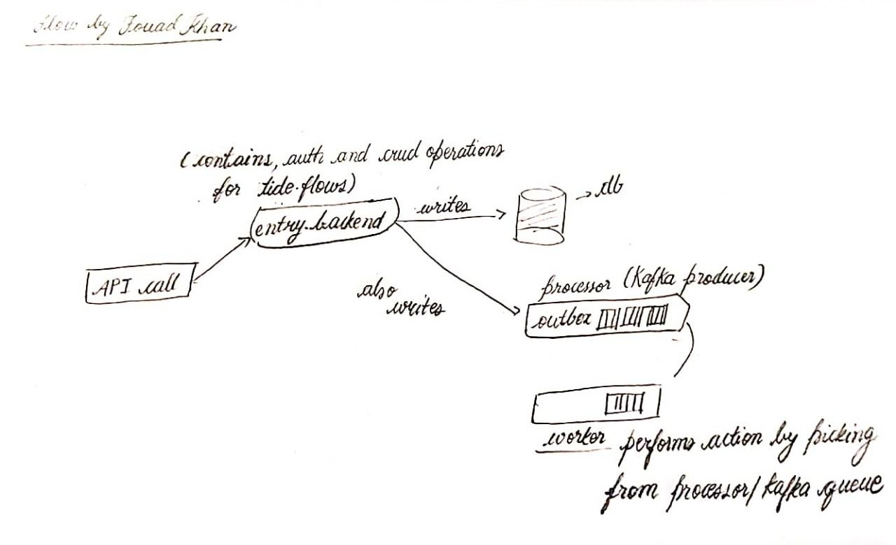

# Flow

<<<<<<< HEAD

# Flow



Flow is a backend system (monorepo) built with Node.js, Express, Kafka, Prisma, and Turborepo all Dockerized for a user-friendly experience. Flow lets users create automated workflows (called Tides) that trigger actions based on webhooks or cron actions.

## Architecture

Flow is a monorepo with six services:

- _entry_backend_ — REST API for authentication, tide (workflow) management, and cron config (start | stop). Runs on port 4200.
- _hooks_ — Webhook receiver that captures incoming HTTP requests and writes them to the transactional outbox. Runs on port 3002.
- _processor_ — Consistently polls the outbox table every 3 seconds and publishes events to Kafka.
- _workers_ — Kafka consumer that executes actions such as sending emails, making HTTP requests or transferring Solana (template scaffolded).
- _scheduler_ — Cron worker that checks every minute for remaining cron triggers and puts them into the outbox.
- _@repo/db_ — Shared Prisma package used by all services. Single schema for all the modules to use.

## Tech Stack

- Node.js + Express
- TypeScript
- Prisma 7 with PostgreSQL
- Kafka via KafkaJS
- Nodemailer for email
- Turborepo for monorepo management
- Docker + Docker Compose

## Getting Started

### Prerequisites

- Docker and Docker Compose installed
- A Gmail account with an App Password for email sending

### Setup

Clone the repository:

```bash
git clone https://github.com/khannfouad/Flow.git
cd Flow
```

Copy the example environment file and fill in your values:

```bash
cp .env.example .env
```

Open `.env` and set:
JWT_SECRET=any_random_string
SMTP_USER=your@gmail.com
SMTP_PASS=your_sixteen_char_app_password
SMTP_FROM=your@gmail.com

To generate a Gmail App Password: Google Account -> Security -> 2-Step Verification -> App Passwords -> Generate.

Start everything:

```bash
docker-compose up --build
```

This will start Postgres, Kafka, run migrations, create the Kafka topic, and start all six services automatically.

### Stopping

```bash
docker-compose down
```

To stop and delete all data:

```bash
docker-compose down -v
```

## API Reference

### Auth

| Method | Endpoint             | Description                 |
| ------ | -------------------- | --------------------------- |
| POST   | /api/v1/users/signup | Register a new user         |
| POST   | /api/v1/users/signin | Sign in and get a JWT token |

### Tides

All tide endpoints require an `Authorization: Bearer <token>` header.

| Method | Endpoint                          | Description                              |
| ------ | --------------------------------- | ---------------------------------------- |
| POST   | /api/v1/tides                     | Create a tide with a webhook trigger     |
| GET    | /api/v1/tides                     | Get all tides for the authenticated user |
| POST   | /api/v1/tides/cron                | Create a tide with a cron trigger        |
| GET    | /api/v1/tides/:tideId/pause       | Pause a tide                             |
| GET    | /api/v1/tides/:tideId/resume      | Resume a tide                            |
| GET    | /api/v1/tides/:tideId/delete      | Soft delete a tide                       |
| GET    | /api/v1/tides/:tideId/hard/delete | Permanently delete a tide                |
| POST   | /api/v1/tides/:tideId/webhook     | Manually trigger a tide                  |
| POST   | /api/v1/tides/:tideId/cron/start  | Start a cron tide                        |
| POST   | /api/v1/tides/:tideId/cron/stop   | Stop a cron tide                         |

### Webhooks

| Method | Endpoint                     | Description             |
| ------ | ---------------------------- | ----------------------- |
| POST   | /hooks/catch/:userId/:tideId | Fire a tide via webhook |

//Cron actions don't require these hooks to fire, once you have created the action you can trigger with the _/start_ endpoint which I have mentioned above.

## Creating a Tide

A tide has a trigger and one or more actions. Since, all tides are placed in a Kafka Queue they are executed sequentially; and also there's a guarentee of atleast one run due to the transactional outbox architecure.

### Webhook tide with email action

```json
POST /api/v1/tides
{
  "availableTriggerId": "webhook",
  "actions": [
    {
      "availableActionId": "email",
      "actionMetaData": {
        "email": "{user.email}",
        "body": "Hi {user.name}, your order {order.id} has been placed"
      }
    }
  ]
}
```

Then trigger it:

```json
POST /hooks/catch/:userId/:tideId
{
  "user": {
    "email": "someone@example.com",
    "name": "John"
  },
  "order": {
    "id": "ORD-123"
  }
}
```

The `{user.email}` and `{user.name}` placeholders are replaced with values from the webhook body at execution time.

### Cron tide

```json
POST /api/v1/tides/cron
{
  "cronExp": "0 9 * * *",
  "actions": [
    {
      "availableActionId": "email",
      "actionMetaData": {
        "email": "someone@example.com",
        "body": "Good morning, this is your daily digest"
      }
    }
  ]
}
```

Start the cron:

```json
POST /api/v1/tides/:tideId/cron/start
```

Stop it:

```json
POST /api/v1/tides/:tideId/cron/stop
```

### HTTP request action

```json
{
  "availableActionId": "http-request",
  "actionMetaData": {
    "url": "https://hooks.slack.com/services/xxx/yyy/zzz",
    "method": "POST",
    "headers": {
      "Content-Type": "application/json"
    },
    "body": {
      "text": "A new tide was triggered"
    }
  }
}
```

## Available Triggers

| ID      | Name    |
| ------- | ------- |
| webhook | Webhook |
| cron    | Cron    |

## Available Actions

| ID           | Name         |
| ------------ | ------------ |
| email        | Send Email   |
| http-request | HTTP Request |
| sol-money    | Send Solana  |

## Seeding the Database

After the containers are running:

```bash
npm run db:seed
```

This inserts the default triggers and actions into the database.

## Transactional Outbox Pattern

Flow has the use case of DB write and event emission preferably in an transactional manner because we don't need to clutter the workflow in this case the tide queue but also all are necessary, hence the architectural choice.
Flow writes Tides in the Tide table and also In an Outbox table, You can think of the OUtbox table as a letter box which waits for the mailman to pick it up and then do the required job or whatever is the further process. Hence, Workers in Flow monitor the Outbox with constant polling waiting to pick up whatever the new tide it populates itself with.
One caveat that this architecture faces is that although there is a guarentee of one run there is no limit to multiple runs hence de-duplication logic is implemented in designing Flow where you have the choice of hitting the Pause or Soft or Hard delete endpoint to stop your workflow once you are done with it.

That's a brief summary of the Project, Thank You for reading this much. :D

## Project Structure

Flow/
├── apps/
│ ├── entry_backend/
│ ├── hooks/
│ ├── processor/
│ ├── workers/
│ └── scheduler/
├── packages/
│ └── db/
│ ├── prisma/
│ │ ├── schema.prisma
│ │ ├── seed.ts
│ │ └── migrations/
│ └── src/
│ └── index.ts
├── docker-compose.yml
├── turbo.json
└── package.json
=======


> > > > > > > 02617e260c69ff6231c6ac3f873fa434d433601d
